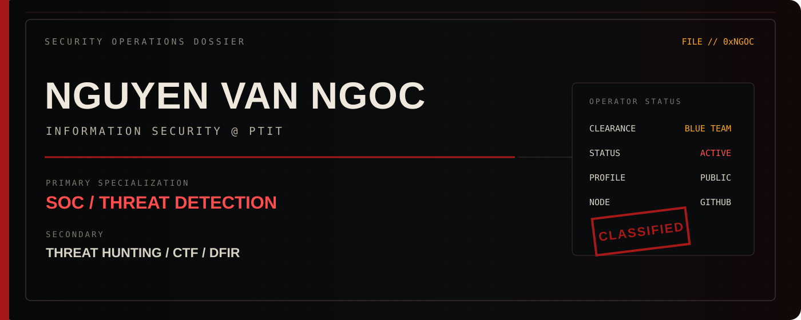
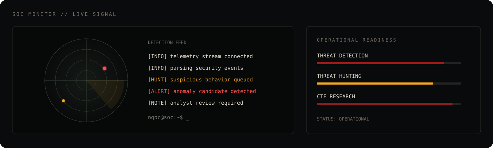
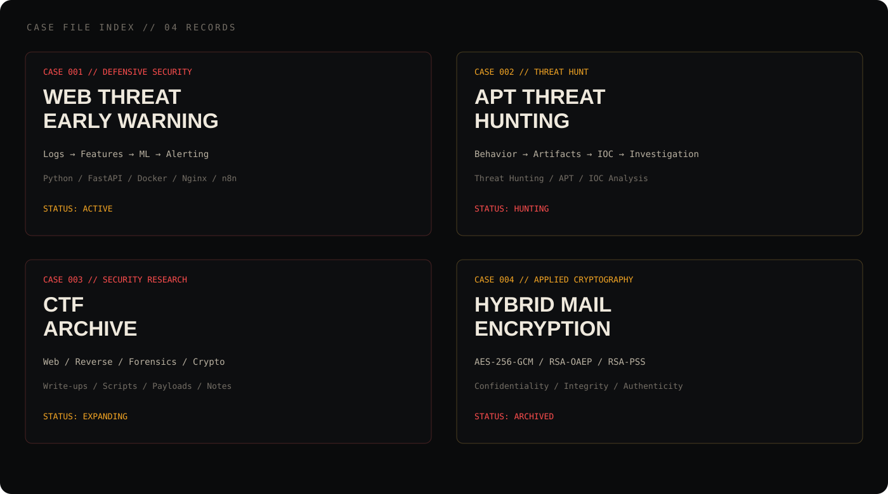
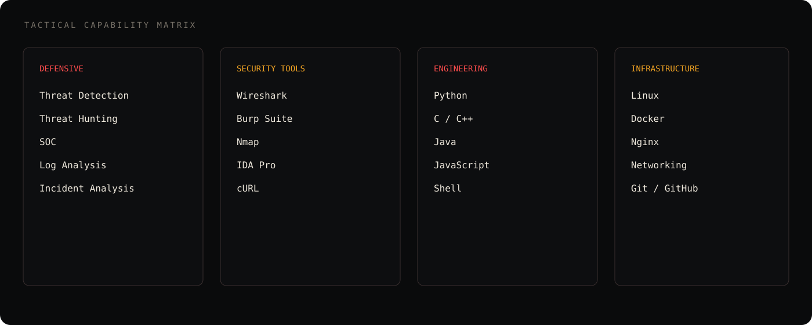
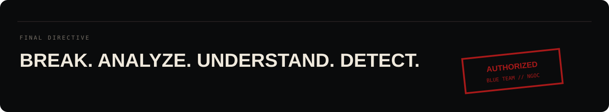

<div align="center">



<br>



</div>

---

## `// OPERATOR DOSSIER`

<table>
<tr>
<td width="62%" valign="top">

### NGUYEN VAN NGOC
**Information Security Student @ PTIT**

```text
CALLSIGN      : NGOC
ROLE          : CYBERSECURITY STUDENT
PRIMARY       : SOC / THREAT DETECTION
SECONDARY     : THREAT HUNTING / CTF
STATUS        : ACTIVE
CLEARANCE     : BLUE TEAM
```

I focus on understanding attacker behavior, analyzing evidence, and building practical detections from logs, artifacts, and system telemetry.

</td>
<td width="38%" valign="top">

### CURRENT STATUS

```text
[●] ONLINE
[●] LEARNING
[●] BUILDING
[●] HUNTING
[●] DOCUMENTING
```

**Mission statement**

> Understand attacks.  
> Find the traces.  
> Build better detections.

</td>
</tr>
</table>

---

## `// ACTIVE CASE FILES`



### CASE 001 — WEB THREAT EARLY WARNING
**Classification:** Defensive Security / Detection Engineering

```text
SOURCE      Nginx / Apache Access Logs
PROCESS     Feature Extraction
ENGINE      Machine Learning
API         FastAPI
STORE       SQLite
AUTOMATION  n8n
OUTPUT      Security Alert
```

[**OPEN CASE FILE →**](https://github.com/nguyenngoc1211/web-threat-early-warning)

---

### CASE 002 — APT THREAT HUNTING
**Classification:** Threat Hunting / Adversary Analysis

```text
OBJECTIVE   Identify suspicious behavior
EVIDENCE    Artifacts / Indicators / Logs
METHOD      Threat Hunting
FOCUS       APT Behavior / IOC Analysis
OUTPUT      Investigation Notes
```

[**OPEN CASE FILE →**](https://github.com/nguyenngoc1211/threat_hunter_APT)

---

### CASE 003 — CTF ARCHIVE
**Classification:** Security Research / Challenge Analysis

```text
WEB          ACTIVE
REVERSE      ACTIVE
FORENSICS    ACTIVE
CRYPTO       ACTIVE
WRITE-UPS    ARCHIVED
```

[**ACCESS ARCHIVE →**](https://github.com/nguyenngoc1211/WU-CTF)

---

### CASE 004 — HYBRID MAIL ENCRYPTION
**Classification:** Applied Cryptography

```text
AES-256-GCM   Data encryption
RSA-OAEP      AES key protection
RSA-PSS       Digital signature
SHA-256       Integrity
```

[**OPEN CASE FILE →**](https://github.com/nguyenngoc1211/ma_lai_RSA_va_AES_ung_dung_ma_hoa_email)

---

## `// TACTICAL CAPABILITIES`



---

## `// FIELD RECORD`

```text
HYTECH SOLUTIONS
ROLE          IT INFRASTRUCTURE INTERN

SYSTEMS       Linux
NETWORK       Networking
CONTAINERS    Docker
PROXY         Nginx
AUTOMATION    Python / Shell
PIPELINE      CI/CD
```

Infrastructure experience gives me a stronger understanding of the systems, traffic, and telemetry used in security monitoring and incident investigation.

---

## `// ACHIEVEMENT LOG`

```text
2024  [GOLD]      1st Prize — D23 miniCTF
2025  [AWARD]     Honorable Mention — PTITCTF
      [ACADEMIC]  Academic Scholarship
      [CERT]      Samsung Penetration Testing Certificate
      [TRAINING]  Applied AI & ML for Network and Information Security
```

---

## `// LIVE GITHUB SIGNAL`

<div align="center">


<br>


</div>

---

## `// CONTRIBUTION TRACE`

<div align="center">

<picture>
  <source media="(prefers-color-scheme: dark)" srcset="https://raw.githubusercontent.com/nguyenngoc1211/nguyenngoc1211/output/github-contribution-grid-snake-dark.svg">
  <source media="(prefers-color-scheme: light)" srcset="https://raw.githubusercontent.com/nguyenngoc1211/nguyenngoc1211/output/github-contribution-grid-snake.svg">
  
</picture>

</div>

---

## `// CURRENT DIRECTIVE`

```text
DIRECTIVE 01  Improve threat detection skills
DIRECTIVE 02  Practice threat hunting
DIRECTIVE 03  Build security automation
DIRECTIVE 04  Analyze real attack patterns
DIRECTIVE 05  Document CTF investigations
```

---



<div align="center">

[](https://github.com/nguyenngoc1211)
[](mailto:hieuhuu113@gmail.com)

</div>
