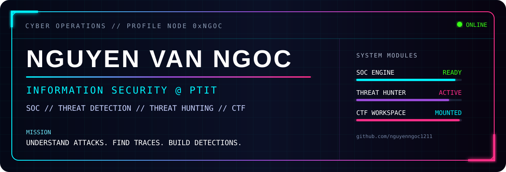
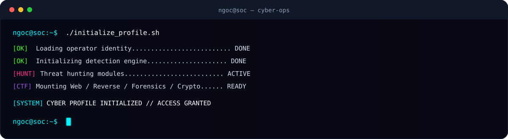
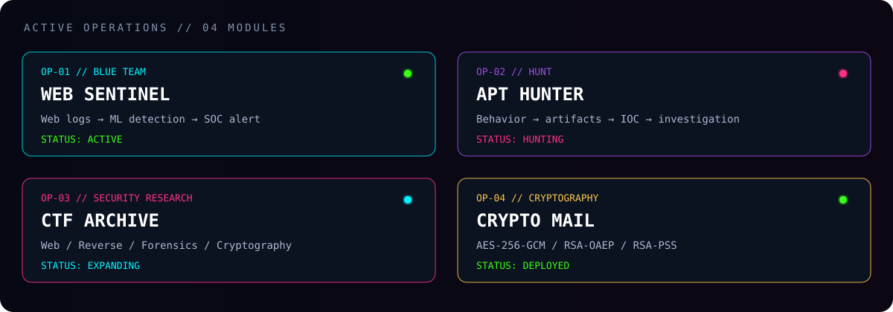
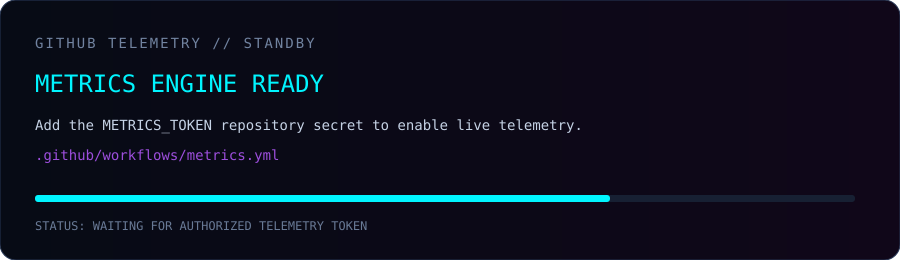

<!--
  NGUYEN VAN NGOC // CYBER OPERATIONS PROFILE
  github.com/nguyenngoc1211
-->

<div align="center">



<br/>


<br/>


</div>

<br/>



---

## `01 // OPERATOR_IDENTITY`

```yaml
operator:
  name: "Nguyen Van Ngoc"
  handle: "@nguyenngoc1211"
  university: "Posts and Telecommunications Institute of Technology (PTIT)"
  major: "Information Security"

focus:
  - SOC
  - Threat Detection
  - Threat Hunting
  - Incident Analysis

interests:
  - Web Security
  - Digital Forensics
  - Reverse Engineering
  - Cryptography
  - Security Automation
  - CTF

mission: "Understand attacks. Find traces. Build detections."
```

<div align="center">


</div>

---

## `02 // ACTIVE_OPERATIONS`



### `OP-01 // WEB SENTINEL` 🛡️
**Web Threat Early Warning** — ML-assisted web attack detection & alert pipeline.

`Nginx/Apache Logs` → `Feature Extraction` → `ML Detection` → `FastAPI` → `SQLite` → `n8n` → `Alert`

[](https://github.com/nguyenngoc1211/web-threat-early-warning)

### `OP-02 // APT HUNTER` 🎯
Threat-hunting practice focused on adversary behavior, indicators, artifacts and investigation workflow.

`Threat Hunting` · `APT Analysis` · `IOC Analysis` · `Attack Behavior` · `Security Investigation`

[](https://github.com/nguyenngoc1211/threat_hunter_APT)

### `OP-03 // CTF ARCHIVE` 🚩
Write-ups, scripts, payloads and notes from security challenges.

`Web` · `Reverse Engineering` · `Digital Forensics` · `Cryptography`

[](https://github.com/nguyenngoc1211/WU-CTF)

### `OP-04 // CRYPTO MAIL` 🔐
Hybrid email encryption implementation using modern cryptographic primitives.

`AES-256-GCM` · `RSA-OAEP` · `RSA-PSS` · `SHA-256`

[](https://github.com/nguyenngoc1211/ma_lai_RSA_va_AES_ung_dung_ma_hoa_email)

---

## `03 // CYBER_ARSENAL`

<table>
<tr>
<td width="50%" valign="top">

### 🛡️ Defensive
`Threat Detection`  
`Threat Hunting`  
`Log Analysis`  
`SOC`  
`Incident Analysis`

</td>
<td width="50%" valign="top">

### ⚔️ Security Tools
`Wireshark`  
`Burp Suite`  
`Nmap`  
`IDA Pro`  
`cURL`

</td>
</tr>
<tr>
<td width="50%" valign="top">

### 💻 Engineering
`Python`  
`C / C++`  
`Java`  
`JavaScript`  
`Shell`

</td>
<td width="50%" valign="top">

### 🐧 Infrastructure
`Linux`  
`Docker`  
`Nginx`  
`Networking`  
`Git / GitHub`

</td>
</tr>
</table>

<div align="center">


</div>

---

## `04 // ACHIEVEMENTS_UNLOCKED`

```text
[UNLOCKED] 🥇 1st Prize            // D23 miniCTF 2024
[UNLOCKED] 🏅 Honorable Mention    // PTITCTF 2025
[UNLOCKED] 🎓 Academic Scholarship // First academic year
[UNLOCKED] 🛡️ Penetration Testing  // Samsung certificate
[TRAINING] 🤖 Applied AI & ML      // Network & Information Security
```

---

## `05 // FIELD_EXPERIENCE`

```text
HYTECH SOLUTIONS
└── IT Infrastructure Intern
    ├── Linux
    ├── Networking
    ├── Docker
    ├── Nginx
    ├── Python / Shell
    └── CI/CD
```

My infrastructure background helps me understand the systems, traffic and telemetry behind security monitoring and incident investigation.

---

## `06 // GITHUB_TELEMETRY`

<div align="center">

<!--
  This file is a cyber-style placeholder on first push.
  After you add METRICS_TOKEN, .github/workflows/metrics.yml
  will replace it with live GitHub metrics.
-->


</div>

---

## `07 // CONTRIBUTION_HUNTER`

<div align="center">

<picture>
  <source media="(prefers-color-scheme: dark)" srcset="https://raw.githubusercontent.com/nguyenngoc1211/nguyenngoc1211/output/github-contribution-grid-snake-dark.svg">
  <source media="(prefers-color-scheme: light)" srcset="https://raw.githubusercontent.com/nguyenngoc1211/nguyenngoc1211/output/github-contribution-grid-snake.svg">
  
</picture>

</div>

> `snake.yml` generates this automatically from your real contribution graph.

---

## `08 // CURRENT_MISSION`

```python
while True:
    learn("defensive security")
    analyze("attack behavior")
    hunt("suspicious activity")
    build("detections")
    solve("CTF challenges")
```

```text
┌──(ngoc㉿soc)-[~/future]
└─$ cat mission.txt

Understand attacks.
Find the traces they leave behind.
Detect them better next time.

┌──(ngoc㉿soc)-[~/future]
└─$ █
```

---

## `09 // CONNECT`

<div align="center">

[](https://github.com/nguyenngoc1211)
[](mailto:hieuhuu113@gmail.com)

<br/><br/>

### `HACK // ANALYZE // DETECT // REPEAT`


</div>
