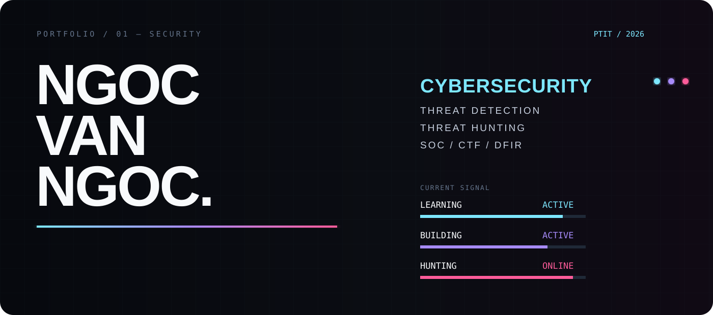
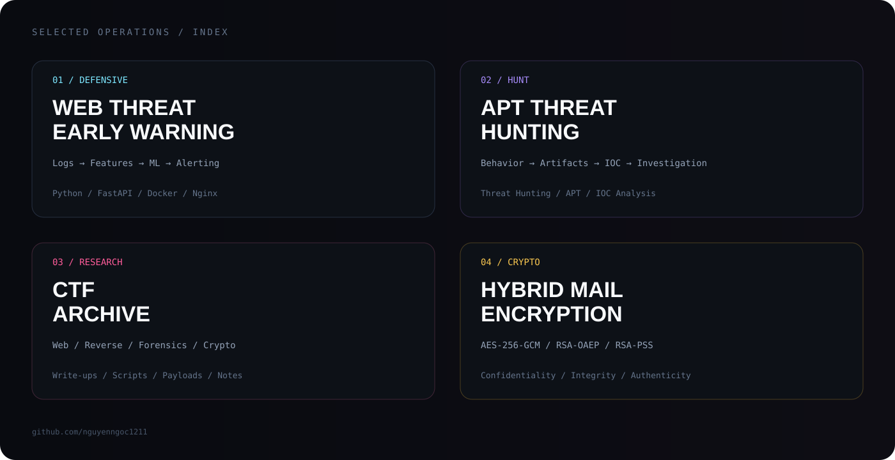
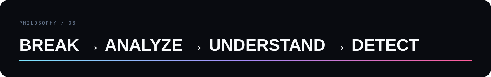

<div align="center">



<br>


<br>

[](https://github.com/nguyenngoc1211)


</div>

---

## 01 / IDENTITY

```text
NGUYEN VAN NGOC
Information Security @ PTIT

FOCUS
Threat Detection / Threat Hunting / SOC

INTERESTS
Web Security / DFIR / Reverse Engineering / Cryptography / CTF

MISSION
Understand attacks. Find traces. Build detections.
```

I am an Information Security student at PTIT, focused on defensive security and practical security research.

I like turning messy technical evidence into something understandable: logs, artifacts, attack behavior, detection logic, and write-ups.

---

## 02 / SELECTED OPERATIONS



### `01 — WEB THREAT EARLY WARNING`
ML-assisted web attack detection and automated alert pipeline.

`Nginx/Apache Logs` → `Feature Extraction` → `ML Detection` → `FastAPI` → `SQLite` → `n8n`

[**Explore project ↗**](https://github.com/nguyenngoc1211/web-threat-early-warning)

### `02 — APT THREAT HUNTING`
Threat-hunting practice centered on attacker behavior, artifacts and indicators.

`Threat Hunting` · `APT Analysis` · `IOC Analysis` · `Security Investigation`

[**Explore project ↗**](https://github.com/nguyenngoc1211/threat_hunter_APT)

### `03 — CTF ARCHIVE`
Write-ups, scripts, payloads and challenge notes.

`Web` · `Reverse Engineering` · `Digital Forensics` · `Cryptography`

[**Read write-ups ↗**](https://github.com/nguyenngoc1211/WU-CTF)

### `04 — HYBRID MAIL ENCRYPTION`
Hybrid cryptography for secure email content and attachments.

`AES-256-GCM` · `RSA-OAEP` · `RSA-PSS` · `SHA-256`

[**Explore project ↗**](https://github.com/nguyenngoc1211/ma_lai_RSA_va_AES_ung_dung_ma_hoa_email)

---

## 03 / CAPABILITIES

<table>
<tr>
<td width="50%" valign="top">

### DEFENSIVE
Threat Detection  
Threat Hunting  
SOC  
Log Analysis  
Incident Analysis

</td>
<td width="50%" valign="top">

### SECURITY
Wireshark  
Burp Suite  
Nmap  
IDA Pro  
cURL

</td>
</tr>

<tr>
<td width="50%" valign="top">

### ENGINEERING
Python  
C / C++  
Java  
JavaScript  
Shell

</td>
<td width="50%" valign="top">

### INFRASTRUCTURE
Linux  
Docker  
Nginx  
Networking  
Git / GitHub

</td>
</tr>
</table>

<div align="center">

</div>

---

## 04 / ACHIEVEMENTS

```text
2024  —  1st Prize, D23 miniCTF
2025  —  Honorable Mention, PTITCTF
      —  Academic Scholarship
      —  Samsung Penetration Testing Certificate
      —  Applied AI & ML for Network and Information Security
```

---

## 05 / EXPERIENCE

### IT Infrastructure Intern — Hytech Solutions

`Linux` · `Networking` · `Docker` · `Nginx` · `Python` · `CI/CD`

Infrastructure experience gives me a stronger foundation for understanding the systems, network behavior and telemetry behind security monitoring.

---

## 06 / GITHUB SIGNAL

<div align="center">


<br>


</div>

---

## 07 / CONTRIBUTION TRACE

<div align="center">

<picture>
  <source media="(prefers-color-scheme: dark)" srcset="https://raw.githubusercontent.com/nguyenngoc1211/nguyenngoc1211/output/github-contribution-grid-snake-dark.svg">
  <source media="(prefers-color-scheme: light)" srcset="https://raw.githubusercontent.com/nguyenngoc1211/nguyenngoc1211/output/github-contribution-grid-snake.svg">
  
</picture>

</div>

---

## 08 / CURRENT FOCUS

```python
current_focus = [
    "Threat Detection",
    "Threat Hunting",
    "SOC Workflow",
    "Incident Analysis",
    "Security Automation",
]

while learning:
    build()
    investigate()
    document()
    improve()
```

---



<div align="center">

[](mailto:hieuhuu113@gmail.com)
[](https://github.com/nguyenngoc1211)

</div>
